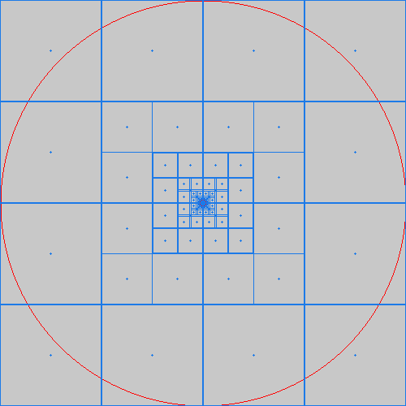

# Visual-Center
Aliases: polyLabel, pole-of-inaccessibility, largest inscribed circle 

Python 3.10 >=
```
pip install visual-center
```

Calculates the pole of inaccessibility of a polygon with optimizations based off of ['A new algorithm for finding a visual center of a polygon'](https://blog.mapbox.com/a-new-algorithm-for-finding-a-visual-center-of-a-polygon-7c77e6492fbc)

This is a port of [Polylabel](https://github.com/mapbox/polylabel)

If this package doesn't suit your needs, there is an alternative port here: [Twista/python-polylabel](https://github.com/Twista/python-polylabel)

This package was created with a personal goal of learning more about quadtrees. I wasn't planning on duplicating a port for the public. But now that we're here, I'm packaging this up for pip. Maybe others will find it useful.

## What is a 'Visual Center'?
The visual center is the point in a polygon that is furthest from the polygon's edge. For basic shapes, the centroid is usually this point, but for more complex shapes this isn't always the case.

For example, the centroid (Blue dot) of this polygon lands outside of it. The visual center (Red dot) is the point that is furthest from the polygon's edge.


## Usage
```python
import visual_center

polygon = [
    [0, 0],
    [0, 100],
    [100, 100],
    [100, 0]
]

pole, distance = visual_center.find_pole(polygon)
```
- Pole is a tuple of the x and y coordinates of the visual center (Named after the [pole-of-inaccessibility](https://en.wikipedia.org/wiki/Pole_of_inaccessibility))
- Distance is the distance from the visual center to the polygon's edge

Examples (Red dot is the pole. Red circle is the distance): 
<p float="left">
  
</p>

### With a hole

This is especially useful for polygons with holes.

```python
import visual_center

polygon = [
    [0, 0],
    [0, 100],
    [100, 100],
    [100, 0]
]

holes = [
    [[50, 10], [50, 90], [90, 90], [90, 10]],
    [[10, 10], [10, 30], [40, 30], [40, 10]]
]

pole, distance = visual_center.find_pole(polygon, holes)
```
First param is the outer shell polygon. Second param is a list of holes.

Example with holes:
<p float="left">
  
   
</p>

## How does it work?
I highly suggest reading the original article: ['A new algorithm for finding a visual center of a polygon'](https://blog.mapbox.com/a-new-algorithm-for-finding-a-visual-center-of-a-polygon-7c77e6492fbc)

tl;dr: Uses quadtree partitioning to recursively subdivide the polygon into smaller cells, probing the centers of these cells as candidates and discarding cells that cannot possibly contain a better solution.

Here's some fun visualizations of the algorithm in action:

<p float="left">
  
   
  
</p>